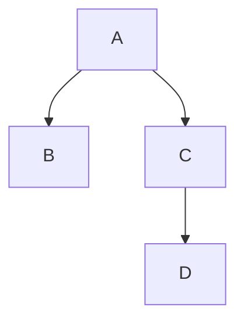

# {Plan 제목}

## 배경
이 plan이 다루는 범위와 관련 컨셉/결정.
- Concepts: [[관련 concept]]
- Decisions: [[관련 decision]]

## 태스크

### Phase 1: {그룹 이름}
- [ ] 태스크 A
- [ ] 태스크 B (A에 의존)

### Phase 2: {그룹 이름}
- [ ] 태스크 C (Phase 1 완료 후)
- [ ] 태스크 D (C와 병렬 가능)

## 의존관계

## 열린 질문
plan 수립 과정에서 해소되지 않은 것들.
